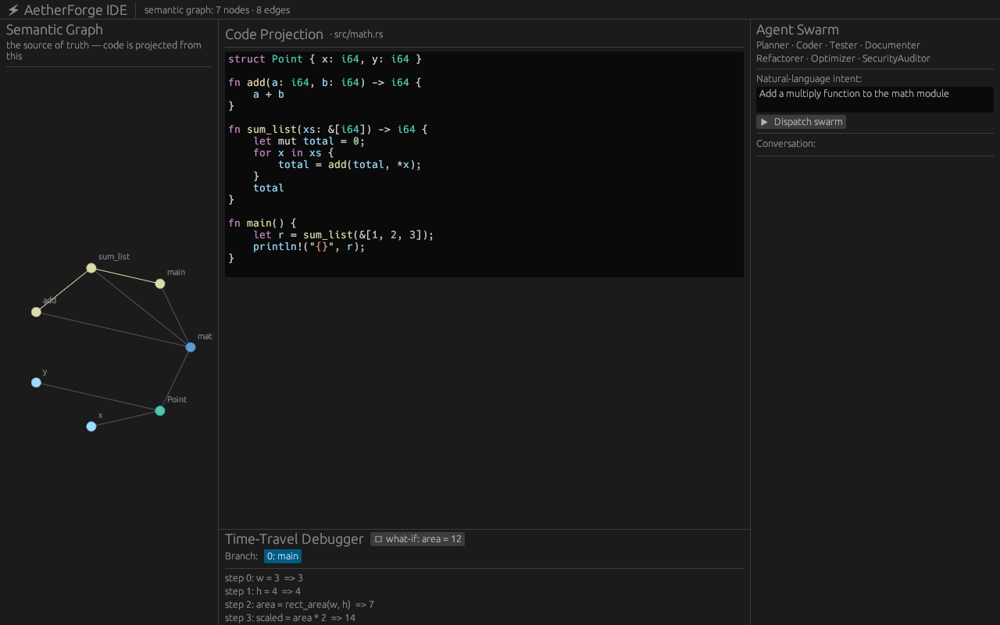

# AetherForge IDE ⚡

**The Semantic Agentic Forge** — a native, GPU-accelerated IDE whose source of
truth is a **living semantic graph** of your codebase, edited in real time by a
**parallel AI agent swarm**, and debugged with a first-class **time-travel &
branching debugger**.

This repo is a runnable Rust prototype of that architecture. It is *not* a fork
of any existing editor. See [`BLUEPRINT.md`](./BLUEPRINT.md) for the full design.

## Quickstart

```bash
# Full end-to-end demo — no GPU, display, or API key required:
cargo run -p aether-app

# Run the test suite (graph, builder, AI router, agent swarm, debugger):
cargo test --workspace
```

### Use it on a real project

AetherForge is also a CLI that operates on actual directories:

```bash
# Build the semantic graph from a project and save it as <dir>/project.aether:
cargo run -p aether-app -- analyze sample-project

# Inspect a saved graph and a node's impact set:
cargo run -p aether-app -- inspect sample-project/project.aether crate::lib::add

# Concept search: rank functions by relevance to a natural-language query:
cargo run -p aether-app -- search sample-project "sum numbers in a list"

# Graph-semantic rename — follows Calls edges (not text search) and rewrites
# only the real callers, then saves the updated graph:
cargo run -p aether-app -- refactor sample-project rename crate::lib::add plus

# Dispatch the agent swarm on a project with a natural-language intent:
cargo run -p aether-app -- forge sample-project "add a subtract function"

# Full help:
cargo run -p aether-app -- --help
```

`analyze`/`forge` walk every `.rs`/`.py` file (skipping `target`, `.git`, …),
build the graph with directory-aware module paths, resolve calls across files,
and persist the `.aether` graph.

### The pipeline demo

`cargo run -p aether-app` (no args) walks the entire pipeline over stdout:

1. **Builds a semantic graph** from source with tree-sitter (the graph is the
   source of truth; text is a projection).
2. **Dispatches the agent swarm** on a natural-language intent
   (*"Add a multiply function to the math module"*) and shows the
   Planner→Coder→Tester collaboration mutating the graph live, including the new
   function's agent-authored source, summary, risk tag, and generated test.
3. **Runs predictive impact analysis** over the graph.
4. **Time-travels a deliberate bug**: records an execution trace, branches a
   what-if fix that re-propagates downstream, and asks the AI layer for a root
   cause.

## Workspace

| Crate | Role |
|---|---|
| `aether-graph` | The living semantic graph: nodes/edges, impact analysis, `.aether` serialization. **Source of truth.** |
| `aether-builder` | tree-sitter → graph mapping, incremental edit sync, syntax-highlight spans. |
| `aether-ai` | `AiProvider` trait, offline `MockProvider`, multi-provider `Router`, provider EXTENSION POINTs. |
| `aether-agents` | The parallel swarm: message bus, orchestrator, 7 specialized agents. |
| `aether-debugger` | Recording interpreter, execution trace, branching timeline, what-if + AI root-cause. |
| `aether-app` | egui/wgpu GUI (feature `gui`) + the headless `smoke` demo binary. |

## The GUI

```bash
cargo run -p aether-app --features gui
```

Four resizable panels: a graph visualizer, a code-projection editor with
tree-sitter highlighting that folds edits back into the graph, an agent console,
and a time-travel debugger timeline with branch controls.

The `gui` feature **compiles and runs** on stable rustc 1.94.1 (the earlier
`winit` `E0282` inference regression is resolved in the current `winit 0.30.13`).
Rendering needs a GPU — or a software Vulkan adapter (Mesa **lavapipe**) plus the
usual X11 libs (e.g. `libxkbcommon-x11`). If no surface can be created the binary
logs the wgpu error and **falls back to the headless demo** automatically, so it
never hard-fails. It was verified headlessly under `Xvfb` + lavapipe:



> The **default headless build, all tests, and the `cargo run` demo require none
> of this** — no GPU, display, or extra system libraries.

## Local-first AI

The default provider is a deterministic, offline `MockProvider`, so everything
runs with no network and no API key. The **Anthropic Claude** provider is fully
implemented (raw HTTPS to the Messages API, default model `claude-opus-4-8`) and
activates with the `live-providers` feature:

```bash
export ANTHROPIC_API_KEY=sk-ant-...
cargo run -p aether-app --features live-providers -- forge sample-project "add a divide function"
```

The `Router` prefers Claude when the key is present and falls back to the mock
otherwise. OpenAI, Gemini, xAI Grok, and local Ollama remain compile-clean
extension points behind the same feature.

## Status

A focused, honest prototype: the three pillars (graph-as-truth, agent swarm,
branching time-travel debug) are real, tested, and runnable at small scale. The
production roadmap (CRDT collaboration, generative extensions, self-optimization,
web/mobile projections, real execution tracing) is in `BLUEPRINT.md §9`.
