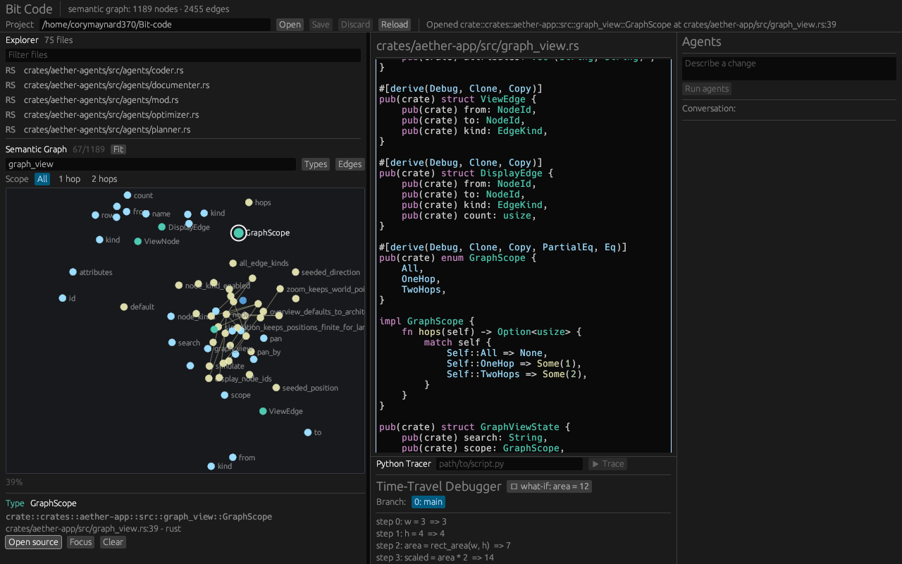

# Bit Code

Bit Code is a native Rust IDE prototype whose source of truth is a living
semantic graph of your codebase. It combines graph-aware editing, a parallel
agent workflow, semantic review/test impact, and time-travel debugging.

This repo is a runnable Rust prototype of that architecture. It is *not* a fork
of any existing editor. See [`BLUEPRINT.md`](./BLUEPRINT.md) for the full design.

## Quickstart

```bash
# Full end-to-end demo — no GPU, display, or API key required:
cargo run -p aether-app

# Run the test suite (graph, builder, AI router, agent swarm, debugger):
cargo test --workspace

# Optional: compile live providers and run the real debugpy adapter test:
cargo check -p aether-ai --features live-providers
python3 -m pip install debugpy
cargo test -p aether-dap --test debugpy -- --ignored
```

### Use it on a real project

Bit Code is also a CLI that operates on actual directories:

```bash
# Build the semantic graph from a project and save it as <dir>/project.aether:
cargo run -p aether-app -- analyze sample-project

# Inspect a saved graph and a node's impact set:
cargo run -p aether-app -- inspect sample-project/project.aether crate::lib::add

# Concept search: rank functions by relevance to a natural-language query:
cargo run -p aether-app -- search sample-project "sum numbers in a list"

# Graph-semantic rename — follows Calls edges (not text search) and rewrites
# only the real callers, then saves the updated graph:
cargo run -p aether-app -- refactor sample-project rename crate::lib::add plus

# Preview what the swarm would build — graph-aware Planner only, no code written:
cargo run -p aether-app -- plan sample-project "add user authentication"

# Dispatch the agent swarm on a project with a natural-language intent:
cargo run -p aether-app -- forge sample-project "add a subtract function"

# Semantic code review vs HEAD (typed mutations, not text diffs):
cargo run -p aether-app -- review sample-project --since HEAD~1

# Minimal test selection: find every test reachable from changed functions:
cargo run -p aether-app -- test-impact sample-project --run

# Knowledge-graph query — answer a question by traversing the semantic graph:
cargo run -p aether-app -- query sample-project "what would break if I change add?"
cargo run -p aether-app -- query sample-project "what calls sum_list?"
cargo run -p aether-app -- query sample-project  # interactive REPL (reads stdin)

# Real Python execution tracer — records every variable at every line/call/return:
cargo run -p aether-app -- debug script.py
cargo run -p aether-app -- debug script.py --what-if x=10 at 2

# DAP adapter dry-run: resolve graph breakpoints without launching an adapter:
cargo run -p aether-app -- dap script.py --dry-run

# Full help:
cargo run -p aether-app -- --help
```

`analyze`/`forge` walk every `.rs`/`.py` file (skipping `target`, `.git`, …),
build the graph with directory-aware module paths, resolve calls across files,
and persist the `.aether` graph. `forge` plans every candidate byte, checks
conflict baselines, validates the candidate in a copied workspace, runs Cargo
build/tests when a manifest is present plus configured validation commands, and
only then journal-commits the source projection and graph together.

### Project configuration

Bit Code works without configuration. To materialize and inspect the validated
defaults for a project:

```bash
cargo run -p aether-app -- config sample-project --init
cargo run -p aether-app -- config sample-project
```

`bitcode.toml` controls source roots and ignore globs, symlink policy, graph
storage, structured impacted-test commands, the agent output module/file, and
candidate-validation commands, timeouts, diagnostic limits, and copy budgets.
Commands are argv arrays rather than interpolated shell strings. On Linux,
available `bubblewrap` support mounts the host filesystem read-only while the
candidate and approved build caches remain writable; other platforms still run
inside the disposable candidate copy. Invalid keys, escaping paths, broken
globs, unsupported graph extensions, malformed commands, and unsupported config
versions fail before project analysis starts.

### The pipeline demo

`cargo run -p aether-app` (no args) walks the entire pipeline over stdout:

1. **Builds a semantic graph** from source with tree-sitter (the graph is the
   source of truth; text is a projection).
2. **Dispatches the agent swarm** on a natural-language intent
   (*"Add a multiply function to the math module"*). The graph-aware Planner reads
   existing nodes before planning; the Coder generates each function, wires Calls
   edges, and emits a FeatureComplete summary; Tester, Documenter, Refactorer,
   SecurityAuditor, and Optimizer annotate in parallel.
3. **Runs predictive impact analysis** over the graph.
4. **Time-travels a deliberate bug**: records an execution trace via `sys.settrace`,
   branches a what-if alternative (variable overridden at a specific step via
   CPython's `PyFrame_LocalsToFast`), shows exactly where the two timelines diverge.

## Workspace

| Crate | Role |
|---|---|
| `aether-graph` | The living semantic graph: nodes/edges, impact analysis, `.aether` serialization. **Source of truth.** |
| `aether-builder` | tree-sitter → graph mapping, incremental edit sync, syntax-highlight spans. |
| `aether-ai` | `AiProvider` trait, offline `MockProvider`, OpenAI/Anthropic live providers, multi-provider `Router`, provider extension points. |
| `aether-agents` | The parallel swarm: message bus, orchestrator, 8 specialized agents. |
| `aether-debugger` | Recording interpreter, execution trace, branching timeline, what-if + AI root-cause. |
| `aether-dap` | Debug Adapter Protocol client/session layer with graph-aware breakpoint support. |
| `aether-app` | egui/wgpu GUI (feature `gui`) + the headless `smoke` demo binary. |

## The GUI

```bash
cargo run -p aether-app --features gui -- --gui sample-project
```

The native workspace opens a configured project, indexes its Rust/Python source,
provides file navigation and language-aware editing, folds edits into the graph,
and reconciles those fresh projections with the durable graph. Agent summaries,
graph-owned nodes, and inferred relationships survive reopen and editor refresh
while source-derived structure follows the files on disk.

The semantic graph is an interactive navigation surface rather than a static
diagram. Its retained force layout keeps positions stable while the graph
changes; pan/zoom, fit-to-view, text search, node/edge type filters, one- and
two-hop focus, viewport culling, and zoom-dependent labels keep large graphs
legible. At overview scale, implementation nodes and their relationships
collapse into weighted module-level connections; zooming in restores exact
types, functions, and enabled relationships. The overview ranks and bounds
module connections so the strongest architectural signals remain readable.
Selecting a node exposes its source location and agent metadata, and
double-clicking or choosing **Open source** moves the editor cursor to its span.

Editor saves use a recoverable journaled transaction for the source projection
and semantic graph. Dirty buffers guard project/file switches, saves detect
external source or graph changes, and startup rolls back an interrupted
multi-file commit before indexing. GUI agent runs mutate a checkpointed graph
and remain visibly pending while validation runs off the render thread. Commit
stays disabled until the exact graph snapshot passes candidate build/tests;
diagnostics remain inspectable and failed candidates can be revalidated or
rolled back. **Commit** projects generated functions to the configured output
file and persists the graph, while **Roll back** cancels validation and restores
the pre-run graph without touching source files.

CI type-checks the `gui` feature on the stable Rust toolchain. Rendering needs a
GPU — or a software Vulkan adapter (Mesa **lavapipe**) plus the usual X11 libs
(e.g. `libxkbcommon-x11`). If no surface can be created the binary logs the wgpu
error and **falls back to the headless demo** automatically, so it never
hard-fails. It has been verified headlessly under `Xvfb` + lavapipe:



> The **default headless build, all tests, and the `cargo run` demo require none
> of this** — no GPU, display, or extra system libraries.

## Local-first AI

The default provider is a deterministic, offline `MockProvider`, so everything
runs with no network and no API key. OpenAI and Anthropic are implemented live
providers behind the `live-providers` feature. OpenAI uses the Responses API and
is selected when `OPENAI_API_KEY` is set:

```bash
export OPENAI_API_KEY=sk-...
export OPENAI_MODEL=gpt-5.6   # optional; this is the default
cargo run -p aether-app --features live-providers -- forge sample-project "add a divide function"
```

Anthropic remains available as a second live provider:

```bash
export ANTHROPIC_API_KEY=sk-ant-...
cargo run -p aether-app --features live-providers -- forge sample-project "add a divide function"
```

The `Router` tries OpenAI first when configured, uses Anthropic as a secondary
live provider for planning/codegen, and falls back to the mock otherwise. Gemini,
xAI Grok, and local Ollama remain compile-clean extension-point structs; they
deliberately do not enter routing until their HTTP bodies are implemented.

## Status

A focused, honest prototype: the three pillars (graph-as-truth, agent swarm,
time-travel debug) are real, tested, and runnable. Implemented features:

| Feature | What it does |
|---|---|
| Semantic graph | Nodes/edges, impact BFS, similarity edges, strict versioned `.aether` persistence and source reconciliation |
| Graph explorer | Retained force layout, pan/zoom, search and typed filters, neighborhood focus, LOD/culling, metadata inspection, source navigation |
| Agent swarm | Planner + Coder + Tester + Documenter + Refactorer + Optimizer + SecurityAuditor + QueryAgent |
| Intent-first planning | Planner reads the graph before planning; generates ordered `FeatureSpec` with Calls-edge wiring |
| Real Python tracer | `sys.settrace` execution recording, what-if branching via `PyFrame_LocalsToFast` |
| Knowledge-graph queries | Natural-language → concept / impact / callers / callees / explain / neighbourhood |
| Semantic review | Typed diff (added/modified/removed nodes + edges), impact radius, test gap report |
| Minimal test selection | Call-graph reachability from changed functions, optional `--run` |
| Project contract | Validated `bitcode.toml` for source scope, graph path, test runners, and agent output |
| Source projection | GUI/CLI agent output and graph rename commit validated source plus graph through recoverable journaled transactions |
| Candidate validation | Disposable project copy, optional bubblewrap isolation, Cargo build/tests, configured checks, cancellation/timeouts, bounded diagnostics, snapshot-bound commit gate |
| DAP integration | Two-phase DAP launch, graph-node breakpoints, stop/stack inspection, and real `debugpy` coverage |

Optional DAP adapter smoke test:

```bash
python3 -m pip install debugpy
cargo test -p aether-dap --test debugpy -- --ignored --nocapture
```

The production roadmap (CRDT collaboration, self-optimization, web/mobile
projections) is in `BLUEPRINT.md §9`.
